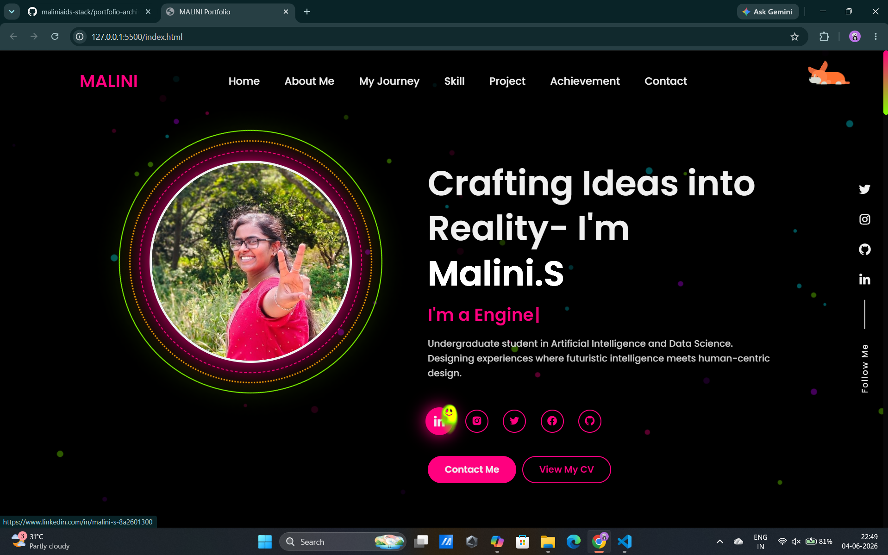

## 📸 Screenshot
Here’s a preview of the portfolio:

# Malini S Portfolio

A personal portfolio website built using HTML, CSS, and JavaScript with a comic/manga-inspired UI.

## About
This portfolio showcases my skills, projects, achievements, and experience as an Artificial Intelligence and Data Science student.

## Features
- Responsive design
- Comic/manga themed interface
- AI Control Room interactive section
- Projects showcase
- Skills dashboard
- Resume download
- Contact form

## Tech Stack
- HTML5
- CSS3
- JavaScript

## Projects Included
- Company Knowledge Base Portal (FastAPI + RAG)
- Auto Free Parking Detection System
- ECG Analyzer App
- Eye Water Diabetic Detector
- College Website UI/UX
- Rubik Cube Solver

## Experience
- Software Developer Intern – Qmax
- Deep Learning Intern

## Deployment
This project can be deployed using:
- GitHub Pages
- Netlify
- Vercel

## Author
**Malini S**  
Artificial Intelligence & Data Science Student  
Web Developer | AI Enthusiast 

## Live Demo
👉 [https://malinisportfolio.netlify.app/](https://malinisportfolio.netlify.app/)